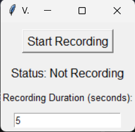

# Voice Recorder 

## Overview
This application allows users to record their speech using a microphone and save it as an audio file (.wav format). The recording continues for the specified duration, and the saved file can be accessed for later use.
## 🖼 Screenshots

## Features
- **Start/Stop Recording**: Click the "Start Recording" button to begin recording your speech. Click again to stop the recording.
- **Audio File Saving**: The app saves the recorded speech as a `.wav` audio file, which can be played back later.
- **Duration Control**: Set the duration for which you want the app to record your speech (in seconds).
- **Error Handling**: Handles various errors including microphone access issues and recording failures.

## Prerequisites
Before running the program, ensure you have the following installed on your system:

- **Python 3.x**
- **PyAudio** for audio recording

## Requirements

To run the Voice Recorder application, make sure the following dependencies are installed:

1. **`pyaudio`**  
   - Used for audio input and recording. The library provides bindings for PortAudio, a cross-platform audio library.
   
2. **`pyautogui`**  
   - Used to simulate keyboard input and control the Notepad application by typing out the transcribed speech.

3. **`SpeechRecognition`**  
   - Used to convert speech input into text. The library supports various speech-to-text engines like Google Web Speech API.

4. **`wave`**  
   - A built-in Python library to handle audio file manipulation and save the recorded audio as a `.wav` file. No installation is required as it comes with Python by default.

5. **`threading`**  
   - A built-in Python module to allow concurrent execution of multiple tasks like audio recording and GUI updates simultaneously.

6. **`datetime`**  
   - A built-in Python module to generate timestamps for naming the audio files based on the current date and time.

## Usage
- **Start the Application**: Run the Python script to launch the Voice Recorder GUI.
- **Set Recording Duration**: Enter the duration in seconds for how long the app should record your speech.
- **Click "Start Recording"**: Speak into your microphone. The app will record your speech and save it as an audio file.
- **Click "Stop Recording"**: Stop recording, and the application will save the speech to a `.wav` file.

## Troubleshooting
If the application doesn't work properly, check the following:
- Make sure your microphone is properly connected and accessible by the app.
- Ensure you have the necessary permissions to use the microphone on your system.
- If PyAudio or SpeechRecognition fails, ensure they are properly installed.

## License
This project is licensed under the [MIT License](LICENSE) - see the LICENSE file for details.

## Acknowledgments
- This project uses the `PyAudio` library for audio recording.
- Special thanks to the developers of these libraries for making audio recording applications possible.
